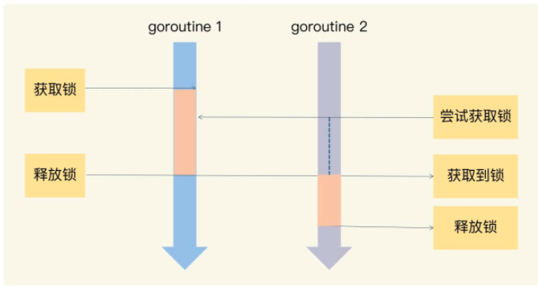
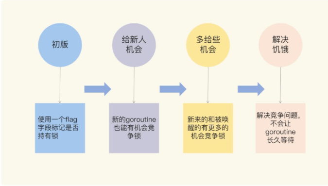

# Mutex: 如何解决并发访问问题

#### 互斥锁的实现机制

> 临界区

在并发编程中，如果程序中的一部分会被并发访问或修改，那么，为了避免并发访问导致的意想不到的结果，这部分程序需要被保护起来，这部分被保护起来的程序，就叫做临界区。

如果很多线程同步访问临界区，就会造成访问或操作错误，这当然不是我们希望看到的结果。所以，我们可以使用互斥锁，限定临界区只能同时由一个线程持有。



Locker的接口定义了锁同步原语的方法集：

```go
type Locker interface {
	Lock()
	Unlock()
}
```


Go 提供了一个检测并发访问共享资源是否有问题的工具：racedetector，它可以帮助我们自动发现程序有没有 data race 的问题。Go race detector是基于 Google 的 C/C++sanitizers 技术实现的，编译器通过探测所有的内存访问，加入代码能监视对这些内存地址的访问（读还是写）。在代码运行的时候，race detector 就能监控到对共享变量的非同步访问，出现 race 的时候，就会打印出警告信息。

#### Mutex的演进

