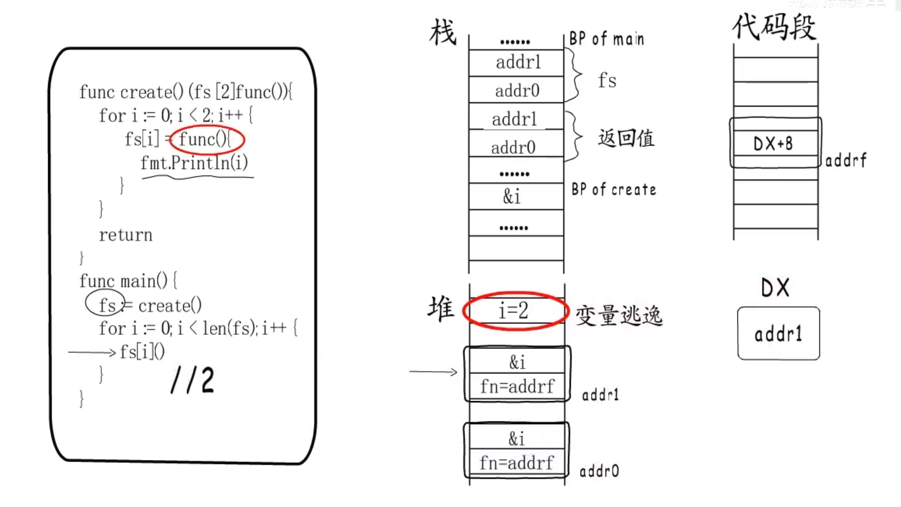

> Go 函数栈布局

+ 栈帧(stack frame)：一个函数的栈空间

+ 栈基(bp): 栈底

+  栈顶(sp) ：栈指针  
+ 函数通过call指令进行跳转，ret指令返回

> 闭包

+ 包含自由变量（函数外部定义但在内部引用）
+ 即便脱离了形成闭包的上下文也能正常运行
+ 闭包称为有状态函数

functionValue是一个包含function指针的二级指针

> 捕获变量

保证外层函数与闭包函数的一致性

1. 被捕获的变量除了初始化没有被修改过则直接拷贝值
2. 

2. 闭包导致局部变量堆分配（导致变量逃逸）

3. 捕获返回值是闭包对象时，编译器会在堆上创建返回值副本