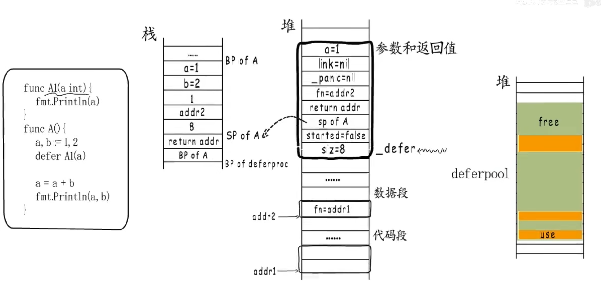

> defer流程

1. 注册：调用deferproc()注册defer函数，注册到一个链表(_defer),新加入的defer会插入到链表头
2. 执行：runtime.deferreturn()



>  1.12版本缺点：慢

1. defer堆上分配，参数还需要在堆与栈之前拷贝
2. 用链表存储，效率低

 

> 1.14 优化： 编译阶段插入代码，把defer执行逻辑展开在函数内


+ Open coded defer: 不需要注册到defer链表,但依然不适用于循环中的defer,保持1.12版本

+ 由于没有注册到链表，发生painc或runtime.Goexit要通过栈扫描的方式来发现defer,defer虽然变快了但导致panic变慢


>painc

```go
type _painc struct{
  argp unsafe.Pointer //defer参数空间地址
  arg interface{} // painc参数
  link *_painc // link to earlier painc
  recoverd bool //是否revoverd
  aborted bool //是否abort
}
```


+ painc 执行defer函数的逻辑：先标记后释放
+ 异常信息输出顺序与painc顺序一致 
+ runtime.gopainc 添加链表_*painc

> revover: 只是将painc中的recoverd置为true

painc流程检测到painc被恢复后会将painc从链表中移除

