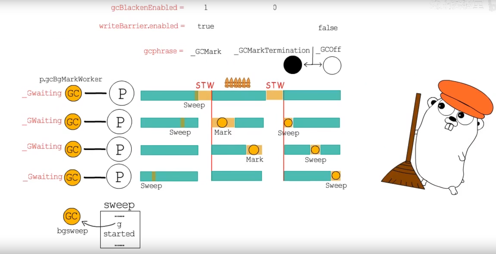
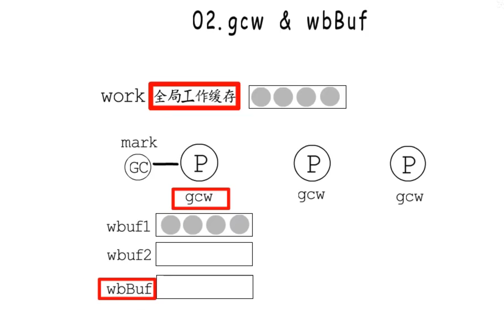

> 内存数据分配

+ 程序要执行 的指令在代码段， 全局变量量静态数据在数据段，函数相关变量、参数、返回值在栈帧中
+  如果在编译阶段不能确定数据的大小或者对象生命周期超出当前函数，应该分配在堆上   

> 增量式垃圾回收

stw分多次与用户程序交替执行

>  三色标记

强三色不变：插入写屏障

弱三色不变：删除写屏障

主体并发增量 回收

混合写屏障: 把对象的修改通知到垃圾回收器，既可以忽略当前栈帧的写屏障，也不用在第二次STW时重新扫描所有活跃g的栈帧	 

> GC过程

 

1. GC准备阶段(Mark Setup): 为每个P创建一个mark worker 协程 。把对应的g指针存储到P中 
2. 第一次STW: GC进入_GCMark阶段，gcphase=__GCMark,writeBarrier.enabled = true（是否开启写屏障）,gcblackenabled=1(标记是否允许GC标记工作)
3. start the world,mark work开始标记工作
4.  当没有标记任务时，开始第二次STW，GC 进入GC MarkTermination阶段，确认标记工作完成gcblackenabled=0
5. 进入_GCOff阶段，关闭写屏障 writeBarrier.enabled = false
6. Start the world,进入清扫阶段

> 标记工作

1. 确定root节点是否为指针：从扫描bss段、数据段、协程栈上的root节点
2. 是否执行堆内存 
3. 根据内存分配时的bitmap(heapAreanbitmap, allocBits,gcmarkBits)信息判断哪些对象应该被标记为灰色

> gcw & wbBuf 
>
> gc工作队列与写屏障缓冲区

markwork消耗工作队列里的对象

> Cpu utilization cpu使用率 25%

控制gc的cpu使用率

> memory alloc  GC Assist

借贷偿还机制

+ gcAssistBytes记录了辅助GC的bytes数，类似于信用额度，小于0需要进行辅助gc, gc markworer会在gcController积累全局信用，小于0的g可以在全局steal尽量多信用

+ GC标记阶段每次分配内存都会检查是否需要”辅助标记“
+ GC清扫阶段每次内存分配会检查是否需要   ”辅助清扫“

> Gc 触发方式

1. 手动触发 runtime.GC
2. 分配内存 runtime.mallocgc
3. 系统监控协程sysmon检测到距离上一次执行gc超过一定时间，会把runtime.forcegchelper加入到runq中,等待被调度执行