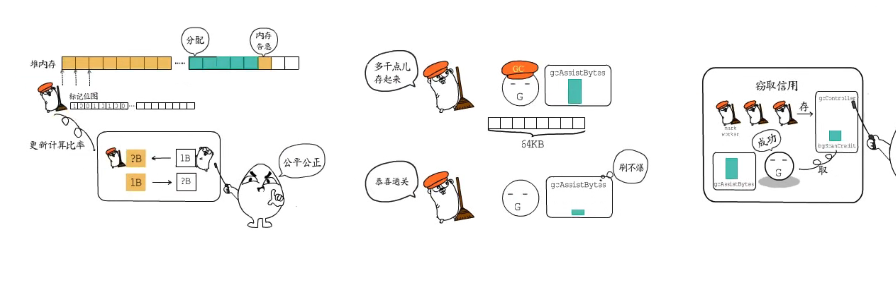
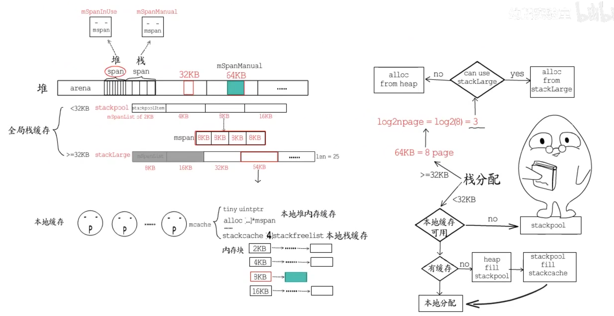

 ### 内存管理

+ mheap: 管理整个堆内存
+ heapArena: arena的结构
+ mspan: span的结构
+ mheap.center: mcenter的数组，长度136，管理mspan
+ p.mcache: 每个p中本地小对象缓存

### 内存分配

mallocgc方法分配

> 辅助GC 

> 空间分配

1. 小于16B的noscan类型用tiny allocator（可将小块的请求合并，提高内存使用率），从mache.tiny中分配  

2. 小于16B的scan类型或大于16B小于32KB的会匹配预置的大小规格来分配 

3. 大于32KB的额外处理

> 位图标记

> 收尾工作

### 栈内存分配

栈增长：编译器在函数头部插入一段代码检查栈空间是否够用，

栈收缩：GC触发 

栈释放

