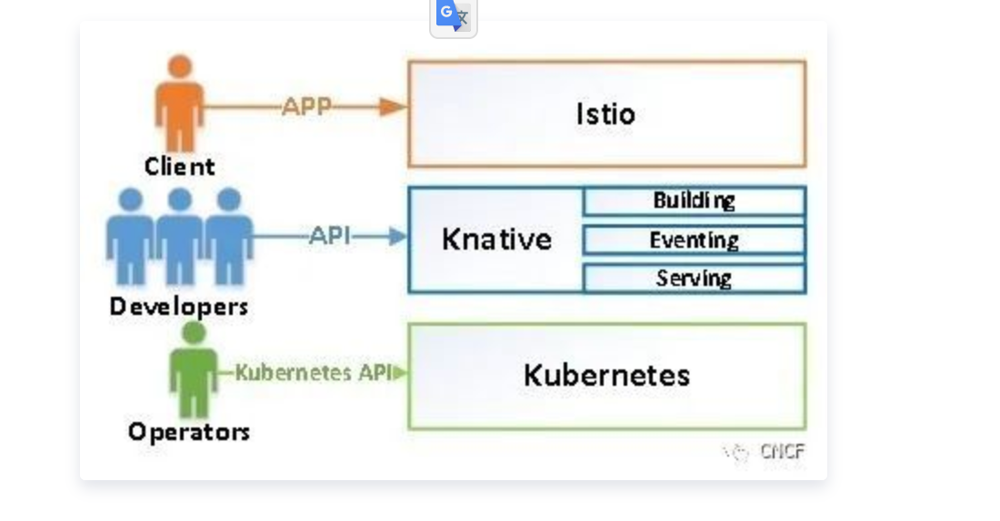

# serverless架构开源框架对比

### OpenWhisk

Apache OpenWhisk是一个用于无服务器计算的开放云平台，它使用云计算资源作为服务。与其他开源项目（Fission、Kubeless、IronFunctions）相比，Apache OpenWhisk的特点是拥有大量的代码库、高质量的特性和大量的贡献者。但是，这个平台上过于庞大的工具（CouchDB、Kafka、Nginx、[Redis](https://cloud.tencent.com/product/crs?from=10680)和Zookeeper）给开发人员带来了困难。此外，这个平台在安全性方面还不完善。

### Firecracker

Firecracker是亚马逊引入的一种虚拟化技术。该技术以最小的开销提供虚拟机，并允许创建和管理隔离的环境和服务。Firecracker提供轻量级虚拟机称为微VM“microVM”，它使用基于硬件的虚拟化技术来实现完全的隔离，同时在传统容器级别上提供性能和灵活性。开发人员的一个不便之处是，该技术的所有开发都是用Rust语言编写的。还使用了带有最少组件集的截断的软件环境。为了节省内存、减少启动时间并提高环境中的安全性，将启动一个修改过的Linux内核，所有多余的东西都将从这个内核中删除。此外，功能和设备支持也减少了。该项目由AWS开发，目的是提高AWS Lambda和AWS Fargate平台的性能和效率。

### OracleFn

Oracle Fn是一个开放服务器的无服务器平台，它为云系统提供了额外的抽象级别，以支持函数即服务（FaaS）。

与Oracle Fn中的其他开放平台一样，开发人员在各个函数级别实现逻辑。不像现有的商业FaaS平台，如Amazon AWS Lambda、Google Cloud Functions和Microsoft Azure Functions，Oracle的解决方案定位为没有厂商锁定。用户可以选择任何云解决方案提供商来启动Fn基础设施、组合不同的云系统或在自己的设备上运行平台。

### KubeLess

Kubeless是一种基础结构，它支持在集群中部署无服务器函数，并使我们能够在Python、Node.js或Ruby代码执行HTTP和事件切换。Kubeless是一个使用Kubernetes的核心功能，如部署、服务、配置卡（ConfigMaps）等构建的平台。这节省了Kubeless基础代码的体积，也意味着开发人员不必重播已经存在于Kubernetes内核内部的大部分调度逻辑代码。

### Fission

Fission是一个开源平台，提供了一个基于Kubernetes的无服务器架构。Fission的优点之一是它可以处理Kubernetes中自动扩展资源的大部分任务，将你从手动资源管理中解放出来。Fission的第二个优点是，你不受一个提供者的约束，可以自由地从一个提供者移动到另一个提供者，前提是它们支持Kubernetes集群（以及你的应用程序可能具有的任何其他特定需求）

### **使用OpenFaaS和Knative的主要好处**

#### OpenFaas

OpenFaaS和Knative是公开可用的自由开源环境，用于创建和托管无服务器的函数。这些平台允许你：

- 减少资源闲置
- 迅速处理数据
- 与其他服务相互连接
- 通过平衡负载密集处理大量请求

OpenFaaS的主要目标是使用Docker容器简化无服务器函数，允许你运行复杂而灵活的基础设施。

**OpenFaas设计与架构**

OpenFaaS架构基于云原生标准，包括以下组件：[API网关](https://cloud.tencent.com/product/apigateway?from=10680)、Watchdog、容器编排器Kubernetes、Docker Swarm、Prometheus和Docker。根据如下所示的架构，当开发人员使用OpenFaaS时，该过程从安装Docker开始，并以网关API结束。

**OpenFaaS的优点和缺点**

OpenFaaS简化了系统的构建。修复错误变得更容易了，并且向系统添加新功能比在单一应用程序的情况下要快得多。换句话说，OpenFaaS允许你随时随地以任何编程语言运行代码。

然而，也有缺点：

- 某些编程语言的冷启动时间很长。
- 容器启动时间取决于提供程序。
- 有限的生命周期的函数，这意味着不是所有的系统都可以根据无服务器架构工作。（当使用OpenFaaS时，计算容器不能在内存中长时间地存储可执行应用程序代码。平台将自动创建和销毁它们。）

#### Knative

Knative允许你开发和部署基于容器的服务器应用程序，你可以轻松地在云提供商之间移植这些应用程序。Knative是一个刚刚开始流行的开源平台，但是今天的开发人员对它非常感兴趣。

**Knative的架构和组件**

Knative架构由Building、Eventing和Serving组件组成。

**Building**

Knative的Building组件负责确保集群中的容器程序集从源代码启动。这个组件在现有的Kubernetes基本功能的基础上工作，并且扩展了它们。

**Eventing**

Knative的Eventing组件负责统一的订阅、交付和事件管理，以及在松散耦合的架构组件之间创建通信。此外，此组件允许你扩展服务器上的负载。

**Serving**

Serving组件的主要目标是支持无服务器应用程序和特性的部署、从零开始的自动扩展、Istio组件的路由和网络编程，以及已部署代码和配置的快照。Knative使用Kubernetes作为编排器，Istio执行查询路由和高级负载平衡功能。

**Knative的优点和缺点**

Knative有很多好处。与OpenFaaS一样，Knative允许你使用容器创建无服务器的环境。这反过来又允许你获得一个本地的基于事件的架构，其中不受公共云服务的限制。Knative还允许你自动化容器组装过程，这就提供了自动伸缩。因此，无服务器函数的能力基于预定义的阈值和事件处理机制。

此外，Knative允许你在内部、云中或第三方数据中心创建应用程序。这意味着你没有绑定到任何一个云提供商。基于Kubernetes和Istio，使得Knative具有更高的采用率和更大的采用率潜力。

Knative的一个主要缺点是需要独立管理容器基础设施。简单地说，Knative并不针对最终用户。然而，由于这一点，市场上有更多的商业管理的Knative服务提供，例如Google Kubernetes Engine和为IBM Cloud Kubernetes Service的Managed Knative。