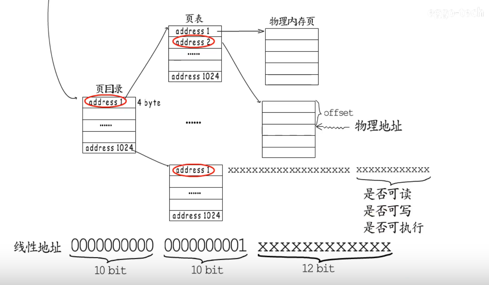

### 虚拟内存

+ 为了保护物理内存，虚拟内存通过线性地址映射到物理内存 
+ 保护模式提供物理内存分页机制，32位系统下以4KB为一页
+ 操作系统以链表的形式记录进程的控制信息（PCB/task_struct）,包含一个指针（页目录的物理地址）
+ 页目录(1024)-->页表(1024)-->物理内存页(4KB) 所以只能寻址4G

+ 线性地址：10bit(页表地址)|10bit(物理页地址)|12bit（偏移量）-->物理内存
+ 进程的虚拟内存只是可以申请使用的一个范围，真正的映射只有在访问的时候才会进行，只有真正被映射的物理内存才是合法使用的虚拟内存

+ CPU中的MMU将虚拟内存的线性地址转换为物理地址，TLB（Translation Lookaside Buffer）将地址缓存,进程切换，TLB要清空，这也是进程切换代价高的一个原因
+ 如果CPU查页表时发现物理内存还没有映射，就会发生page fault

