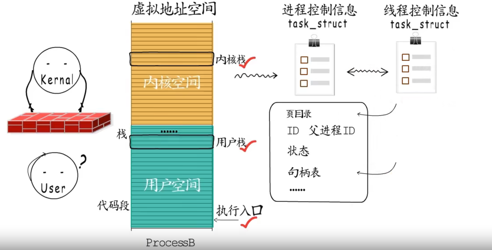
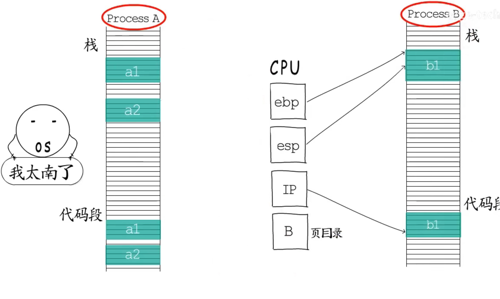

为了保障系统运行安全，虚拟地址被划分为用户空间和内核空间，操作系统运行在用户空间，用户程序运行在用户空间

内核空间由所有进程的地址空间共享 ，用户程序不能访问内核空间 

### 线程

+ 线程就是进程中的执行体 ，创建线程时，操作系统会在用户空间和内核空间创建两端栈，分别是用户栈和内核栈操作系统会为每个线程记入执行入口，线程栈、线程ID等信息（TCB）
+ 程序执行时CPU中的IP指向的是线程的执行入口，所以说线程是操作系统调度与执行的基本单位
+ 一个进程中至少有一个线程（main thread）
+  线程进行系统调用时，切换到内核态，使用内核栈调用系统函数 ，CPU的中断控制器通过接收中断信号（0x80） 将用户态切换到内核态，后改为特殊指令触发切换（syscall）
+ 线程的切换 :一个线程的时间片用完时，CPU硬件时钟会触发一次时钟中断 ，中断程序会从就绪的线程中挑选一个执行

线程执行

进程、线程切换

