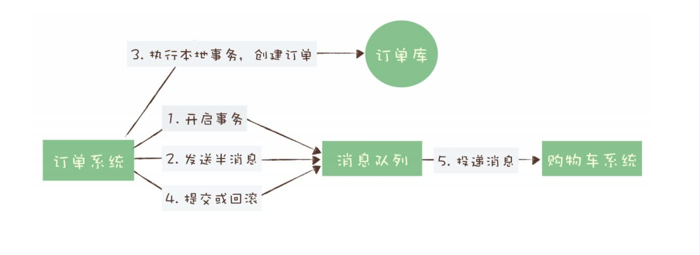
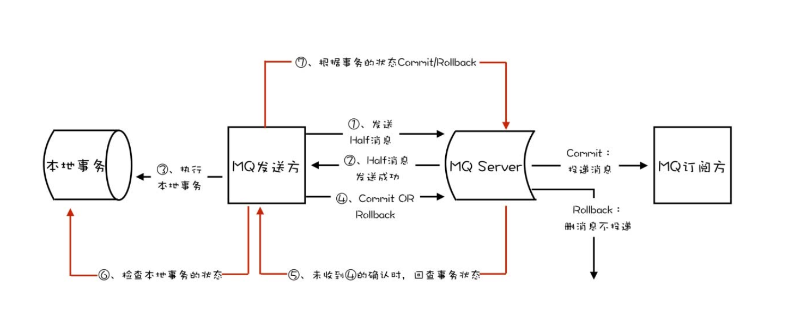

# 如何利用事务消息实现分布式事务

#### 事务的4大特性

一个严格意义的事务实现，应该具有 4 个属性：原子性、一致性、隔离性、持久性。这四个属性通常称为 ACID 特性。

+ 原子性，是指一个事务操作不可分割，要么成功，要么失败，不能有一半成功一半失败的情况。
+ 一致性，是指这些数据在事务执行完成这个时间点之前，读到的一定是更新前的数据，之后读到的一定是更新后的数据，不应该存在一个时刻，让用户读到更新过程中的数据。
+ 隔离性，是指一个事务的执行不能被其他事务干扰。即一个事务内部的操作及使用的数据对正在进行的其他事务是隔离的，并发执行的各个事务之间不能互相干扰，这个有点儿像我们打网游中的副本，我们在副本中打的怪和掉的装备，与其他副本没有任何关联也不会互相影响。
+ 持久性，是指一个事务一旦完成提交，后续的其他操作和故障都不会对事务的结果产生任何影响。

##### 案例

##### RocketMQ 分布式事务实现

在 RocketMQ 中的事务实现中，增加了事务反查的机制来解决事务消息提交失败的问题。如果 Producer 也就是订单系统，在提交或者回滚事务消息时发生网络异常，RocketMQ的 Broker 没有收到提交或者回滚的请求，Broker 会定期去 Producer 上反查这个事务对应的本地事务的状态，然后根据反查结果决定提交或者回滚这个事务。