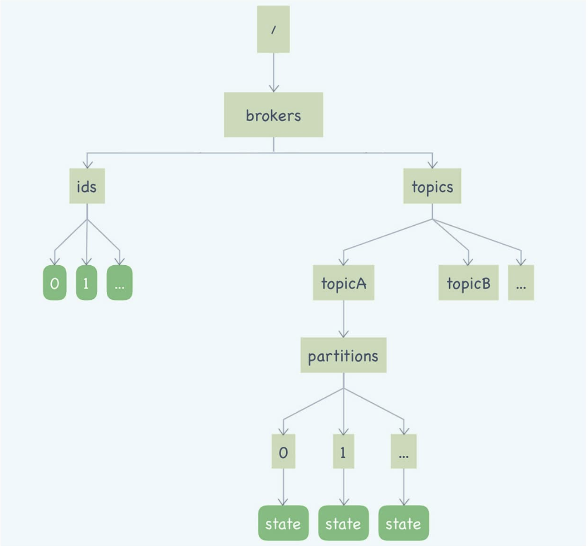

# Kafka如何实现高性能IO

#### 使用批量消息提升服务端处理能力

当你调用 send() 方法发送一条消息之后，无论你是同步发送还是异步发送，Kafka 都不会立即就把这条消息发送出去。它会先把这条消息，存放在内存中缓存起来，然后选择合适的时机把缓存中的所有消息组成一批，一次性发给 Broker。简单地说，就是攒一波一起发。在 Kafka 的服务端，也就是 Broker 这一端，又是如何处理这一批一批的消息呢？在服务端，Kafka 不会把一批消息再还原成多条消息，再一条一条地处理，这样太慢了。Kafka 这块儿处理的非常聪明，每批消息都会被当做一个“批消息”来处理。也就是说，在Broker 整个处理流程中，无论是写入磁盘、从磁盘读出来、还是复制到其他副本这些流程中，批消息都不会被解开，一直是作为一条“批消息”来进行处理的。

#### 使用顺序读写提升磁盘IO性能

Kafka 就是充分利用了磁盘的这个特性。它的存储设计非常简单，对于每个分区，它把从Producer 收到的消息，顺序地写入对应的 log 文件中，一个文件写满了，就开启一个新的文件这样顺序写下去。消费的时候，也是从某个全局的位置开始，也就是某一个 log 文件中的某个位置开始，顺序地把消息读出来。

#### 利用PageCache加速消息读写

Kafka 在读写消息文件的时候，充分利用了 PageCache 的特性。一般来说，消息刚刚写入到服务端就会被消费，按照 LRU 的“优先清除最近最少使用的页”这种策略，读取的时候，对于这种刚刚写入的 PageCache，命中的几率会非常高。也就是说，大部分情况下，消费读消息都会命中 PageCache，带来的好处有两个：一个是读取的速度会非常快，另外一个是，给写入消息让出磁盘的 IO 资源，间接也提升了写入的性能。

#### ZeroCopy：零拷贝技术

处理消费的大致逻辑是这样的：

首先，从文件中找到消息数据，读到内存中；然后，把消息通过网络发给客户端。

这个过程中，数据实际上做了 2 次或者 3 次复制：

1. 从文件复制数据到 PageCache 中，如果命中 PageCache，这一步可以省掉；

2. 从 PageCache 复制到应用程序的内存空间中，也就是我们可以操作的对象所在的内存；
3. 从应用程序的内存空间复制到 Socket 的缓冲区，这个过程就是我们调用网络应用框架的 API 发送数据的过程。

Kafka 使用零拷贝技术可以把这个复制次数减少一次，上面的 2、3 步骤两次复制合并成一次复制。直接从 PageCache 中把数据复制到 Socket 缓冲区中，这样不仅减少一次数据复制，更重要的是，由于不用把数据复制到用户内存空间，DMA 控制器可以直接完成数据复制，不需要 CPU 参与，速度更快。

### 如何利用缓存来减少磁盘IO

读写缓存的这种设计，它天然就是不可靠的，是一种牺牲数据一致性换取性能的设计。

在实现只读缓存的时候，你需要考虑的第一个问题是如何来更新缓存。这里面有三种方法，第一种是在更新数据的同时去更新缓存，第二种是定期来更新全部缓存，第三种是给缓存中的每个数据设置一个有效期，让它自然过期以达到更新的目的。这三种方法在更新的及时性上和实现的复杂度这两方面，都是依次递减的，你可以按需选择。对于缓存的置换策略，最优的策略一定是你根据业务来设计的定制化的置换策略，当然你也可以考虑 LRU 这样通用的缓存置换算法。

### 数据压缩：时间换空间

在开启压缩时，Kafka 选择一批消息一起压缩，每一个批消息就是一个压缩分段。使用者也可以通过参数来控制每批消息的大小。

 Kafka 中，生产者生成一个批消息发给服务端，在服务端中是不会拆分批消息的。那按照批来压缩，意味着，在服务端也不用对这批消息进行解压，可以整批直接存储，然后整批发送给消费者。最后，批消息由消费者进行解压。在服务端不用解压，就不会耗费服务端宝贵的 CPU 资源，同时还能获得压缩后，占用传输带宽小，占用存储空间小的这些好处，这是一个非常聪明的设计。在使用 Kafka 时，如果生产者和消费者的 CPU 资源不是特别吃紧，开启压缩后，可以节省网络带宽和服务端的存储空间，提升总体的吞吐量，一般都是个不错的选择。

### 消息复制实现差异

#### RocketMQ如何实现复制？

RocketMQ 提供了两种复制方式，一种是异步复制，消息先发送到主节点上，就返回“写入成功”，然后消息再异步复制到从节点上。另外一种方式是同步双写，消息同步双写到主从节点上，主从都写成功，才返回“写入成功”。这两种方式本质上的区别是，写入多少个副本再返回“写入成功”的问题，异步复制需要的副本数是 1，同步双写需要的副本数是2。

在 RocketMQ 中，Broker 的主从关系是通过配置固定的，不支持动态切换。如果主节点宕机，生产者就不能再生产消息了，消费者可以自动切换到从节点继续进行消费。这时候，即使有一些消息没有来得及复制到从节点上，这些消息依然躺在主节点的磁盘上，除非是主节点的磁盘坏了，否则等主节点重新恢复服务的时候，这些消息依然可以继续复制到从节点上，也可以继续消费，不会丢消息，消息的顺序也是没有问题的。

#### Kafka是如何实现复制的？

Kafka 中，复制的基本单位是分区。每个分区的几个副本之间，构成一个小的复制集群，Broker 只是这些分区副本的容器，所以 Kafka 的 Broker 是不分主从的。分区的多个副本中也是采用一主多从的方式。Kafka 在写入消息的时候，采用的也是异步复制的方式。消息在写入到主节点之后，并不会马上返回写入成功，而是等待足够多的节点都复制成功后再返回。在 Kafka 中这个“足够多”是多少呢？Kafka 的设计哲学是，让用户自己来决定。Kafka 为这个“足够多”创造了一个专有名词：ISR（In Sync Replicas)，翻译过来就是“保持数据同步的副本”。ISR 的数量是可配的，但需要注意的是，这个 ISR 中是包含主节点的。Kafka 使用 ZooKeeper 来监控每个分区的多个节点，如果发现某个分区的主节点宕机了，Kafka 会利用 ZooKeeper 来选出一个新的主节点，这样解决了可用性的问题。ZooKeeper 是一个分布式协调服务，后面，我会专门用一节课来介绍 ZooKeeper。选举的时候，会从所有 ISR 节点中来选新的主节点，这样可以保证数据一致性。默认情况下，如果所有的 ISR 节点都宕机了，分区就无法提供服务了。你也可以选择配置成让分区继续提供服务，这样只要有一个节点还活着，就可以提供服务，代价是无法保证数据一致性，会丢消息。

#### kafka的协调服务：zookeeper

Kafka 在每个 Broker 中都维护了一份和 ZooKeeper 中一样的元数据缓存，并不是每次客户端请求元数据就去读一次 ZooKeeper。由于 ZooKeeper 提供了 Watcher 这种监控机制，Kafka 可以感知到 ZooKeeper 中的元数据变化，从而及时更新 Broker 中的元数据缓存。

ZooKeeper 也并不是完美的，在使用的时候你需要注意几个问题：

1. 不要往 ZooKeeper 里面写入大量数据，它不是一个真正意义上的存储系统，只适合存放少量的数据。依据服务器配置的不同，ZooKeeper 在写入超过几百 MB 数据之后，性能和稳定性都会严重下降。
2. 不要让业务集群的可用性依赖于 ZooKeeper 的可用性。因为 ZooKeeper 的选举过程是比较慢的，而它对网络的抖动又比较敏感，一旦触发选举，这段时间内的 ZooKeeper 是不能提供任何服务的。