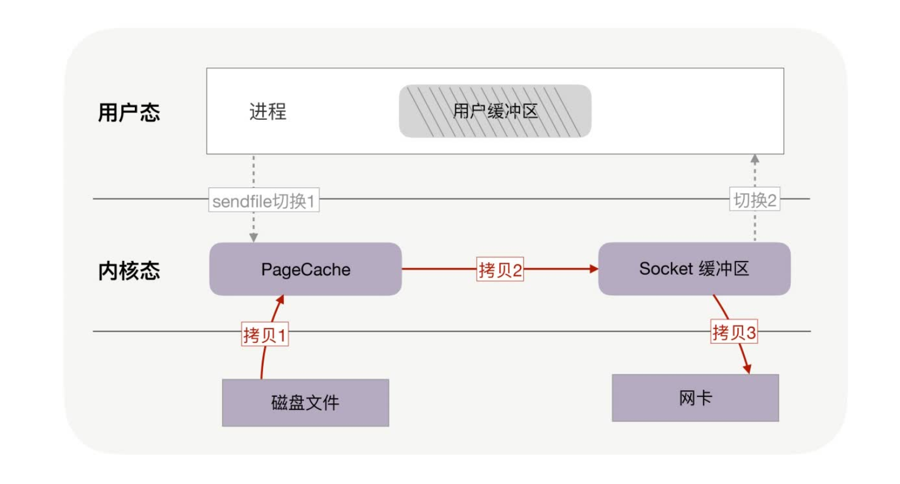
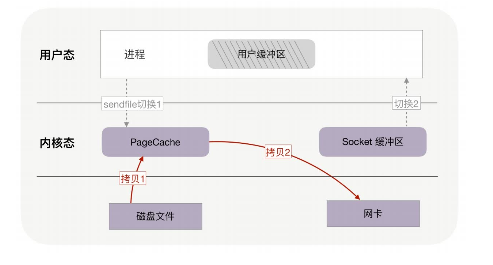

## 怎样让CPU执行更快

+ CPU 缓存分为数据缓存与指令缓存，对于数据缓存，我们应在循环体中尽量操作同一块内存上的数据，由于缓存是根据 CPU Cache Line 批量操作数据的，所以顺序地操作连续内存数据时也有性能提升。

+ 对于指令缓存，有规律的条件分支能够让 CPU 的分支预测发挥作用，进一步提升执行效率。对于多核系统，如果进程的缓存命中率非常高，则可以考虑绑定 CPU 来提升缓存命中率。

## 提升内存分配效率

+ 进程申请内存的速度，以及总内存空间都受到内存池的影响。知道这些隐藏内存池的存在，是提升分配内存效率的前提。
+ 隐藏着的 C 库内存池，对进程的内存开销有很大的影响。当进程的占用空间超出预期时，你需要清楚你正在使用的是什么内存池，它对每个线程预分配了多大的空间。
+ 不同的 C 库内存池，都有它们最适合的应用场景，例如 TCMalloc 对多线程下的小内存分配特别友好，而 Ptmalloc2 则对各类尺寸的内存申请都有稳定的表现，更加通用。
+ 内存池管理着堆内存，它的分配速度比不上在栈中分配内存。只是栈中分配的内存受到生命周期和容量大小的限制，应用场景更为有限。然而，如果有可能的话，尽量在栈中分配内存，它比内存池中的堆内存分配速度快很多！

## 如何高效地传输文件

+ 用户缓冲区没有必须存在的理由

+ 如果网卡支持 SG-DMA（The Scatter-Gather Direct Memory Access）技术，还可以再去除 Socket 缓冲区的拷贝，这样一共只有 2 次内存拷贝。

PageCache，磁盘高速缓存

### 大文件读取异步IO+直接IO

绕过 PageCache 的 IO 是个新物种，我们把它称为直接 IO。对于磁盘，异步 IO 只支持直接 IO。

+ 基于用户缓冲区传输文件时，过多的内存拷贝与上下文切换次数会降低性能。零拷贝技术在内核中完成内存拷贝，天然降低了内存拷贝次数。它通过一次系统调用合并了磁盘读取与网络发送两个操作，降低了上下文切换次数。尤其是，由于拷贝在内核中完成，它可以最大化使用 socket 缓冲区的可用空间，从而提高了一次系统调用中处理的数据量，进一步降低了上下文切换次数。

+ 零拷贝技术基于 PageCache，而 PageCache 缓存了最近访问过的数据，提升了访问缓存数据的性能，同时，为了解决机械磁盘寻址慢的问题，它还协助 IO 调度算法实现了 IO 合并与预读（这也是顺序读比随机读性能好的原因），这进一步提升了零拷贝的性能。几乎所有操作系统都支持零拷贝，如果应用场景就是把文件发送到网络中，那么我们应当选择使用了零拷贝的解决方案。
+ 不过，零拷贝有一个缺点，就是不允许进程对文件内容作一些加工再发送，比如数据压缩后再发送。另外，当 PageCache 引发负作用时，也不能使用零拷贝，此时可以用异步 IO+直接 IO 替换。我们通常会设定一个文件大小阈值，针对大文件使用异步 IO 和直接 IO，而对小文件使用零拷贝。

## 如何根据业务场景选择合适的锁

+ 互斥锁能够满足各类功能性要求，特别是被锁住的代码执行时间不可控时，它通过内核执行线程切换及时释放了资源，但它的性能消耗最大。需要注意的是，协程的互斥锁实现原理完全不同，它并不与内核打交道，虽然不能跨线程工作，但效率很高。
+ 如果能够确定被锁住的代码取到锁后很快就能释放，应该使用更高效的自旋锁，它特别适合基于异步编程实现的高并发服务。
+ 如果能区分出读写操作，读写锁就是第一选择，它允许多个读线程同时持有读锁，提高了并发性。读写锁是有倾向性的，读优先锁很高效，但容易让写线程饿死，而写优先锁会优先服务写线程，但对读线程亲和性差一些。还有一种公平读写锁，它通过把等待锁的线程排队，以略微牺牲性能的方式，保证了某种线程不会饿死，通用性更佳。
+ 当并发访问共享资源，冲突概率非常低的时候，可以选择无锁编程。它在 Web 和数据库中有广泛的应用。然而，一旦冲突概率上升，就不适合使用它，因为它解决冲突的重试成本非常高。

## 一对多通讯

+ 在 TCP 协议分层后，IP 协议天然就支持一对多通讯方式。TCP 协议面向连接的特性使它放弃了一对多的通讯方式，而 UDP 协议则继承了 IP 协议的这一功能。所以，在一对多通讯场景中，我们会选择 UDP 协议。
+ 正确输入广播地址的前提，是理解 IP 地址如何划分为网络 ID 和主机 ID。当主机 ID 所有的比特位改为全 1 时，IP 地址就表示该网络下的所有主机，这就是广播地址。当向广播地址发送 UDP 消息时，网络中的所有主机都会收到。广播在局域网中有广泛的应用，转换 IP地址与 MAC 地址的 ARP 协议就是用广播实现的。
+ 广播对无关的主机增加了不必要的负担，而组播可以更精准地“定向”广播。组播地址也被称为 D 类地址，它描述的虚拟组要通过 IGMP 协议管理。网络 API 中的 setsockopt 函数可以通过 IGMP 协议，向虚拟组中添加或者删除 IP 地址。当路由器支持 IGMP 协议时，组播就可以跨越多个网络实现更广泛的一对多通讯。

## 通过监控找到性能瓶颈

+ 在 Linux 系统中，你可以用内核支持的 perf 工具，快速地生成火焰图。其他高级编程语言生态中，都有类似的 Profiler 工具，可生成火焰图。
+ 火焰图中可以看到函数调用栈，它对你分析源码很有帮助。图中方块的长度表示函数的调用频率，当采样很密集时，你可以把它近似为函数的执行时长。父方块长度减去所有子方块长度的和，就表示了父函数自身代码对 CPU 计算力的消耗。因此，火焰图可以直观地找到调用次数最频繁且最耗时的函数。
+ 对于分布式系统，性能监控还有利于系统的扩容和缩容运维。搭建性能监控体系包括以下四个关键点：首先要把五花八门的日志用正则表达式提取为结构化的监控数据；其次用半结构化的列式数据库存放集群中的所有日志，便于后续的汇聚分析；第三，使用统一的请求 ID将各组件串联在一起，并使用 MapReduce 算法对大量的监控数据做离线分析；最后，通过实时流计算框架，对监控数据做实时汇聚分析。

## 怎样舍弃一致性去换取性能

+ CAP 理论指出，可用性、分区容错性、一致性三者只能取其二，因此当分布式系统需要服务更多的用户时，只能舍弃一致性，换取可用性中的性能因子。当然，性能与一致性并不是简单的二选一，而是需要你根据网络时延、故障概率设计出一致性模型，在提供高性能的同时，保持时间、空间上可接受的最终一致性。
+ 具体的设计方法，可以分为纵向上添加缓存，横向上添加副本进程两种做法。对于缓存的更新，write through 模式保持一致性更容易，但写请求的时延偏高，而一致性模型更复杂的write back 模式时延则更低，适用于性能要求很高的场景。
+ 提升系统并发性可以通过添加数据副本，并让工作在副本上的进程同时对用户提供服务。副本间的数据同步是由写请求触发的，其中包括同步、异步两种同步方式。异步方式的最终一致性要差一些，但写请求的处理时延更快。在宕机恢复、系统扩容时，采用快照加操作日志的方式，系统的性能会好很多。

## 怎样通过可拓展性来提高性能

KF 立方体的 X、Y、Z 三个轴扩展系统提升性能。

+ X 轴扩展系统时实施成本最低，只需要将程序复制到不同的服务器上运行，再用下游的负载均衡分配流量即可。X 轴只能应用在无状态进程上，故无法解决数据增长引入的性能瓶颈。
+ Y 轴扩展系统时实施成本最高，通常涉及到部分代码的重构，但它通过拆分功能，使系统中的组件分工更细，因此可以解决数据增长带来的性能压力，也可以提升系统的总体效率。比如关系数据库的读写分离、表字段的垂直拆分，或者引入缓存，都属于沿 Y 轴扩展系统。
+ Z 轴扩展系统时实施成本也比较高，但它基于用户信息拆分数据后，可以在解决数据增长问题的同时，基于地理位置就近提供服务，进而大幅度降低请求的时延，比如常见的 CDN 就是这么提升用户体验的。但 Z 轴扩展系统后，一旦发生路由规则的变动导致数据迁移时，运维成本就会比较高。

## 如何修改读写模型提升性能

NWR 算法将这一原理一般化为：只要读节点数 R + 写节点数 W > 存储节点数 N，特别是 W > N/2 时，就能使去中心的分布式系统获得强一致性。

## 如何更高效地负载均衡

一致性哈希算法

+ 一致性哈希算法将 32 位哈希值构成环，并将它分段赋予各节点，这样，扩容、缩容动作就只影响相邻节点，大幅度减少了数据迁移量。一致性哈希算法虽然将数据的迁移量从 O(M) 降为 O(M/N)，却也将映射函数的时间复杂度从 O(1) 提高到 O(logN)，但由于节点数量 N 并不会很大，所以一致性哈希算法的性价比还是很高的。
+ 当哈希值分布不均匀时，数据分布也不会均衡。在哈希环与真实节点间，添加虚拟节点层，可以通过新的哈希函数，分散不均匀的数据。每个真实节点含有的虚拟节点数越多，数据分布便会越均衡，但同时也会消耗更多的内存与计算力。
+ 虚拟节点带来的最大优点，是宕机时由所有节点共同分担流量缺口，这避免了可能产生的雪崩效应。同时，扩容的新节点也会分流所有节点的压力，这也提升了系统整体资源的利用率。

## 如何权衡关系数据库与NoSQL数据库

+ 关系数据库通过行、列交汇处的单一值，实现了多种数据间的关联。通过统一的 SQL 接口，用户可以在数据库中实现复杂的计算任务。为了维持关联数据间的一致性，关系数据库提供了拥有 ACID 特性的事务，提升了应用层的开发效率。
+ 虽然单一值无法映射内存中的复合数据结构，但通过 ORM 框架，关系数据库可以将表映射为面向对象编程中的类，将每行数据映射为对象，继续降低开发成本。然而，关系数据库是为单机设计的，一旦将事务延伸到分布式系统中，执行成本就会高到影响基本的可用性。因此，关系数据库的可伸缩性是很差的。
+ NoSQL 数据库基于 Key/Value 数据模型，可以提供几乎无限的可伸缩性。同时，将Value 值进一步设计为复合结构后，既可以增加查询方式的多样性，也可以通过MapReduce 提升系统的计算能力。实际上，关系数据库与每一类 NoSQL 数据库都有明显的优缺点，我们可以从数据模型、访问方式、数据容量上观察它们，结合具体的应用场景权衡取舍。

## HTTP2  性能提升

+ 静态表和 Huffman 编码可以将 HTTP 头部压缩近一半的体积，但这只是连接上第 1 个请求的压缩比。后续请求头部通过动态表可以压缩 90% 以上，这大大提升了编码效率。当然，动态表也会导致内存占用过大，影响服务器的总体并发能力，因此服务器会限制HTTP/2 连接的使用时长。
+ HTTP/2 的另一个优势是实现了 Stream 并发，这节约了 TCP 和 TLS 协议的握手时间，并减少了 TCP 的慢启动阶段对流量的影响。同时，Stream 之间可以用 Weight 权重调节优先级，还可以直接设置 Stream 间的依赖关系，这样接收端就可以获得更优秀的体验。
+ HTTP/2 支持消息推送，从 HTTP/1.1 的拉模式到推模式，信息传输效率有了巨大的提升。HTTP/2 推消息时，会使用 PUSH_PROMISE 帧传输头部，并用双号的 Stream 来传递包体，了解这一点对定位复杂的网络问题很有帮助。
+ HTTP/2 的最大问题来自于它下层的 TCP 协议。由于 TCP 是字符流协议，在前 1 字符未到达时，后接收到的字符只能存放在内核的缓冲区里，即使它们是并发的 Stream，应用层的HTTP/2 协议也无法收到失序的报文，这就叫做队头阻塞问题。解决方案是放弃 TCP 协议，转而使用 UDP 协议作为传输层协议，这就是 HTTP/3 协议的由来。