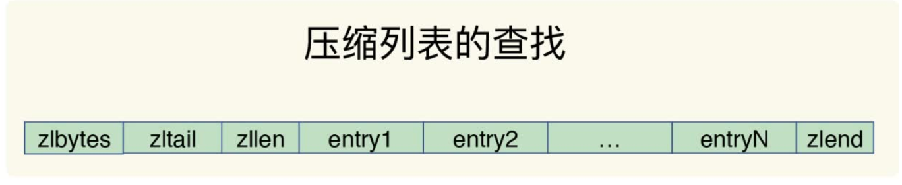
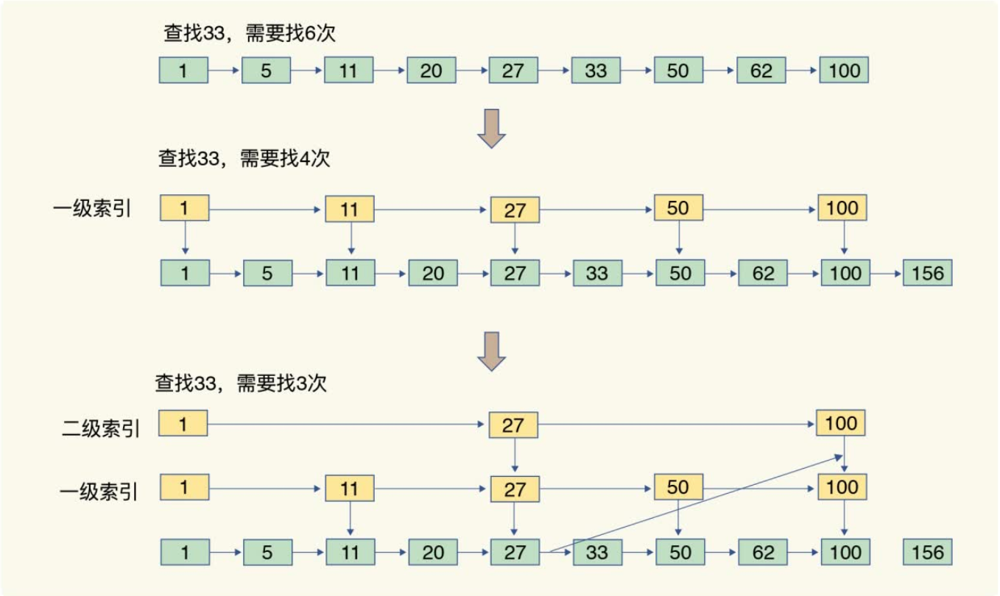
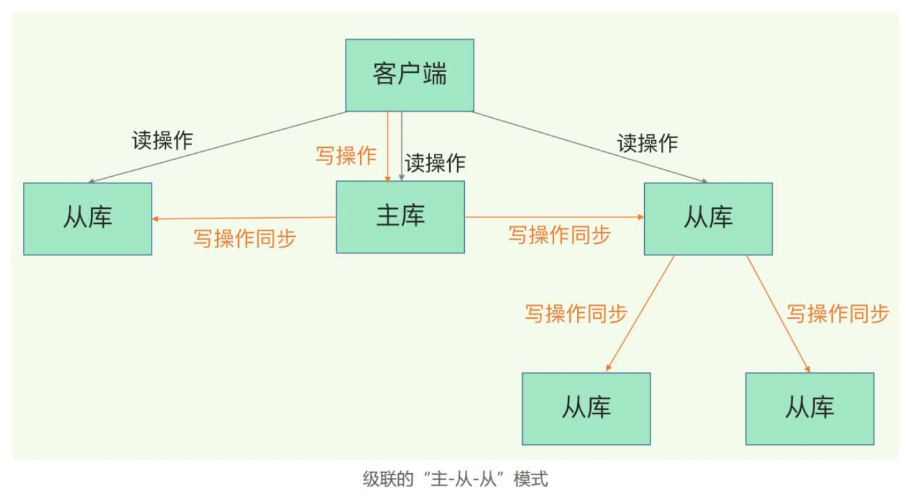
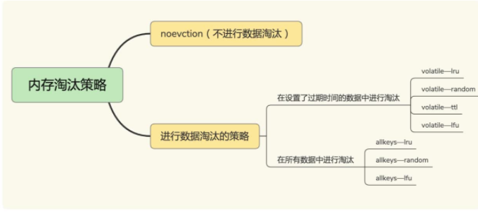
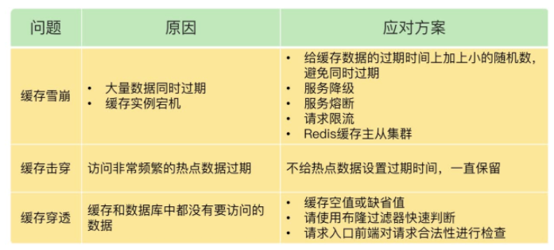

### redis数据结构


Key/value 结构组织


#### 解决hash冲突

1. 给哈希表 2 分配更大的空间，例如是当前哈希表 1 大小的两倍；
2. 把哈希表 1 中的数据重新映射并拷贝到哈希表 2 中；（避免数据大量拷贝，采用渐进式扩容与go相似）
3. 释放哈希表 1 的空间。


> 压缩链表

类似于一个数组，数组中的每一个元素都对应保存一个数据。和数组不同的是，压缩列表在表头有三个字段 zlbytes、zltail 和 zllen，分别表示列表长度、列表尾的偏移量和列表中的 entry 个数；压缩列表在表尾还有一个 zlend，表示列表结束。（查找慢）



> 跳表（ziplist）解决经典双端链表在保存小数据而导致内存利用率低

跳表在链表的基础上，增加了多级索引，通过索引位置的几个跳转，实现数据的快速定位（查找快，需要的空间更多）



#### 不同操作复杂度

4句口口诀：

单元素操作是基础；

范围操作非常耗时；（SCAN 操作渐进式遍历）

统计操作通常高效；（链表、数组中有专门存储长度）

例外情况只有几个。

### redis 为什么那么快

redis的单线程：Redis 的网络 IO和执行命令（键值对读写）是由一个线程来完成的，这也是 Redis 对外提供键值存储服务的主要流程。

采用epoll,IO多路复用模型，非阻塞IO

多线程开销：线程上下文切换耗CPU，全局资源争抢要加锁。

如何充分利用多核CPU：部署多个redis实例

单线程缺点：如果发送耗时操作（如：bigkey的遍历操作）


### 主从级联模式分担全量复制的主库压力



问题：网络断链或阻塞，主从库之间就无法进行命令传播了，主从数据不一致。

当主从库断连后，主库会把断连期间收到的写操作命令，写入 replication buffer，同时也会把这些操作命令也写入 repl_backlog_buffer 这个缓冲区。repl_backlog_buffer 是一个环形缓冲区，主库会记录自己写到的位置，从库则会记录自己已经读到的位置。


repl_backlog_size = 缓冲空间大小 * 2

> 一个 Redis 实例的数据库不要太大，一个实例大小在几 GB 级别比较合适，这样可以减少 RDB 文件生成、传输和重新加载的开销。

### 缓存异常

+ 针对缓存雪崩，合理地设置数据过期时间，以及搭建高可靠缓存集群；

+ 针对缓存击穿，在缓存访问非常频繁的热点数据时，不要设置过期时间；

+ 针对缓存穿透，提前在入口前端实现恶意请求检测，或者规范数据库的数据删除操作，避免误删除。


### 如何避免阻塞

redis 实例运行时的 4 大类交互对象：客户端、磁盘、主从库实例、切片集群实例。

基于这 4 大类交互对象，我们梳理了会导致 Redis 性能受损的 5 大阻塞点，包括集合全量查询和聚合操作、bigkey 删除、清空数据库、AOF 日志同步写，以及从库加载 RDB 文件。

在这 5 大阻塞点中，bigkey 删除、清空数据库、AOF 日志同步写不属于关键路径操作，可以使用异步子线程机制来完成。Redis 在运行时会创建三个子线程，主线程会通过一个任务队列和三个子线程进行交互。子线程会根据任务的具体类型，来执行相应的异步操作。


### 实现分布式锁

+ 加锁

```
SET key value [ EX seconds | PX milliseconds] [NX]
//加锁 ,unique_value 作为客户端唯一性的标识 
SET lock_key unique_value NX PX 10000
```

unique_value 是客户端的唯一标识，可以用一个随机生成的字符串来表示，PX10000 则表示 lock_key 会在 10s 后过期，以免客户端在这期间发生异常而无法释放锁。

+ 释放锁


在释放锁操作中，我们使用了 Lua 脚本，这是因为，释放锁操作的逻辑也包含了读取锁变量、判断值、删除锁变量的多个操作，而 Redis 在执行 Lua 脚本时，可以以原子性的方式执行，从而保证了锁释放操作的原子性。

#### 基于多个Redis节点实现高可靠的分布式锁

Redis 的开发者 Antirez 提出了分布式锁算法 Redlock。

Redlock 算法的基本思路，是让客户端和多个独立的 Redis 实例依次请求加锁，如果客户端能够和半数以上的实例成功地完成加锁操作，那么我们就认为，客户端成功地获得分布式锁了，否则加锁失败。这样一来，即使有单个 Redis 实例发生故障，因为锁变量在其它实例上也有保存，所以，客户端仍然可以正常地进行锁操作，锁变量并不会丢失。

### redis中的事务


1. 原子性：某个命令执行失败不影响其他，原子性得不到保证
2. 一致性：Redis 事务机制对一致性属性是有保证的。
3. 隔离性：watch机制可以保证
4. 持久性：取决于reids的持久化配置，难以得到保证


### redis 变慢

+ 响应延迟（操作bigkey）,大批key同时过期
+ 基线性能
+ 文件系统（AOF模式），
+ 操作系统swap

### redis 内存淘汰策略



### 如何解决缓存与数据库不一致

> 先更新缓存后更新数据库

重试机制，将要操作的相关值放入消息队列，消费消息进行重试，一直重试失败可以发送告警。

问题：在高并发的情况下，如果在A线程删除缓存后，更新数据库期间，有B线程访问该值，会导致B拿到数据库中的旧值，重新写会redis，后续线程都会直接读到reids中的旧值

解决方案：延迟双删，等A更新完数据后后，sleep一会（为了让B写回redis之后）再删除缓存，sleep时间需根据真实写入速度情况预估

> 先更新数据，后删除缓存

线程A在更新数据后后，更新缓存期间，B线程会读取到缓存中的旧值，由于更新缓存的速度比较快，在请求量不大的情况下，影响较小

### 如何解决缓存雪崩、击穿、穿透



### redis如何应对并发访问

+ 单命令操作，INCR/DECR 命令
+ lua脚本，Redis 会把整个 Lua 脚本作为一个整体执行，在执行的过程中不会被其他命令打断，从而保证了 Lua 脚本中操作的原子性。


### redis支持秒杀场景的关键

> 第一阶段: 秒杀活动前

用户不到刷新页面

方案： 把商品详情页面元素静态化，使用CDN加速、浏览器缓存

> 第二阶段：秒杀活动开始

此时大量用户点击，大量并发请求查询库存，将库存信息保存在redis中，进行查验和扣减（保证原子性）

> 第三阶段：秒杀结束

可能有用户在等待其它用户退单。此时流量应该下降很多，一般能支撑


+ 为支撑更多商品秒杀，可以使用切片集群，将不同商品分散到不同实例，避免单一实例压力过大

+ 保证库存查验和扣减的原子性操作

